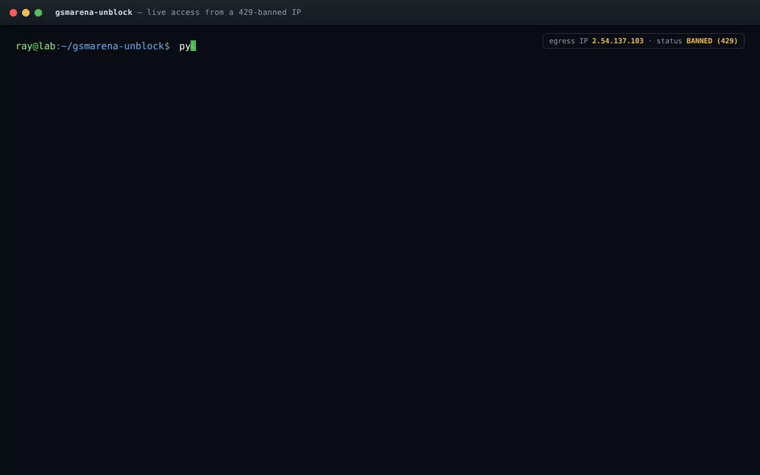
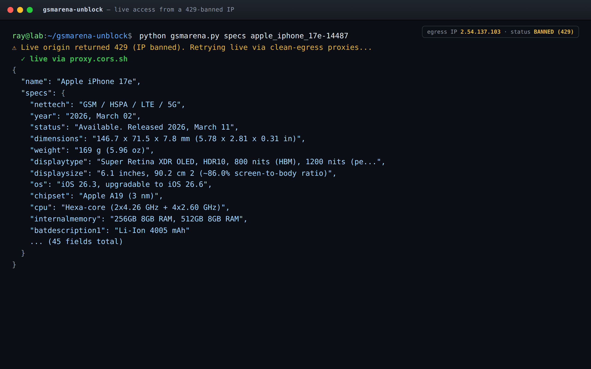
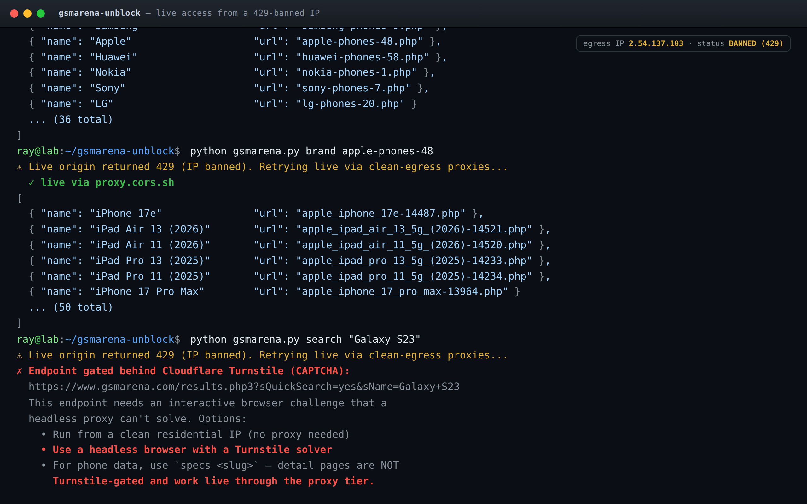

# gsmarena-unblock

Reverse-engineered GSMArena's ad-block detection and built bypass tools.

## Demo

Live phone data pulled from a **fully 429-banned IP** via the clean-egress proxy tier:



| `specs` — live spec sheet | `search` — Turnstile detected |
|---|---|
|  |  |

GSMArena uses **three independent client-side detectors** that funnel into one server-side enforcement: an HTTP 429 wall with a 10-hour ban. There is no client-side overlay — the kill switch is a cookie.

## How the detection works

```
                          ┌─────────────────────┐
                          │    misc.js (1P)      │
                          │  bait div + dc fetch │
                          └─────────┬───────────┘
                                    │ parity-encoded
                                    ▼
┌──────────────┐    ┌───────────────────────────────┐    ┌──────────────┐
│  srvb1.com   │───▶│   DeviceID cookie             │◀───│  Playwire    │
│  diff pixels │    │   ODD = blocked, EVEN = clean │    │  RAMP + BT   │
└──────────────┘    └───────────────┬───────────────┘    └──────────────┘
                                    │
                    ┌───────────────┤
                    │               │
                    ▼               ▼
            ┌──────────────┐ ┌──────────────────┐
            │ beacon ratio │ │ IP reputation    │
            │ counter-js   │ │ request cadence  │
            └──────┬───────┘ └────────┬─────────┘
                   │                  │
                   ▼                  ▼
            ┌─────────────────────────────────┐
            │  HTTP 429 · Retry-After: 36000  │
            │         (10-hour ban)            │
            └─────────────────────────────────┘
```

### The DeviceID cookie trick

`misc.js` creates a bait `<div>` with ad-like class names, checks `offsetHeight === 0` after 100ms, then probes `ad.doubleclick.net/favicon.ico`. The result is encoded in the **parity** of a `DeviceID` cookie:

- **Odd** = ad-blocker detected
- **Even** = clean

The server reads `value % 2` on every request. The cookie is re-set on every `beforeunload`, so single-clear doesn't work.

## Quick start

### Browser users — uBlock Origin filter list

Import `filters/gsmarena-bypass.txt` into uBlock Origin:

1. Open uBlock Origin → Dashboard → Filter lists → Import
2. Paste: `https://raw.githubusercontent.com/<you>/gsmarena-unblock/main/filters/gsmarena-bypass.txt`
3. Apply changes

Or add the rules manually in "My filters":

```
! Force DeviceID cookie to even (neutralizes server signal)
gsmarena.com##+js(trusted-set-cookie, DeviceID, 10000)

! Allow counter beacon (prevents beacon starvation signal)
@@||gsmarena.com/counter-js.php3

! Allow doubleclick favicon probe (it's detection, not an ad)
@@||ad.doubleclick.net/favicon.ico$domain=gsmarena.com

! Allow ad-delivery probe (Blockthrough detection)
@@||ad-delivery.net/px.gif$domain=gsmarena.com
```

### Programmatic access — Python

```bash
pip install -r requirements.txt
python gsmarena.py search "Samsung Galaxy S24"
python gsmarena.py specs samsung_galaxy_s24-12644
python gsmarena.py brands
```

The client handles cookie management, detection evasion, and rate limiting automatically.

### Two separate walls — know which one you hit

GSMArena has **two independent blocking systems**. Bypassing them requires different things:

| Wall | Trigger | Fix |
|------|---------|-----|
| **Ad-block detection** | `DeviceID` cookie parity, blocked ad probes | The 4 filter rules / this client's cookie forcing |
| **IP/ASN 429 ban** | Datacenter IP, scraper-rate requests, bad IP reputation | A clean **residential** IP + human request rate |

The cookie bypass only helps on a **clean IP**. It cannot rescue an already-banned IP — the 429 is stamped server-side against the IP before any cookie is read. Datacenter and proxy IPs (including Tor and most reader-proxies) are 429-banned outright.

### Three-tier access — works even from a banned IP

The client tries three routes in order and stops at the first that returns real content:

| Tier | Route | Data | Works from banned IP? |
|------|-------|------|-----------------------|
| 1 | **Direct** live origin + cookie bypass | live | needs clean IP |
| 2 | **Clean-egress CORS proxy** (`proxy.cors.sh`, `r.jina.ai`) | **live** | ✅ yes |
| 3 | **Wayback Machine** (archived snapshot) | archived | ✅ yes |

Tier 2 is the key: the proxy fetches the **live** page from an un-banned IP, so you get current data even when your own IP is 429-banned. Verified pulling a March-2026 phone from a fully-banned IP:

```
$ python gsmarena.py specs apple_iphone_17e-14487
⚠ Live origin returned 429 (IP banned). Retrying live via clean-egress proxies...
  ✓ live via proxy.cors.sh
{ "name": "Apple iPhone 17e",
  "specs": { "chipset": "Apple A19 (3 nm)", "os": "iOS 26.3, ...", ... } }
```

`specs`, `brands`, and `brand <slug>` all work through this tier. **`search`** hits a **Cloudflare Turnstile CAPTCHA** (a third wall, only on `results.php3`) that a headless proxy can't solve — the client detects it and prints alternatives. Use `brand <slug>` to enumerate phones instead, or run `search` from a clean residential IP.

### Already banned?

You don't need to wait out the 10-hour ban — tier 2 (live proxy) and tier 3 (Wayback) both work immediately from the banned IP. For direct live browsing in a real browser: change your IP (VPN, residential proxy, mobile-hotspot IP cycle) and apply the filter rules before visiting.

## Use as a library (`gsmarena_fetch`)

Other tools can import the tiered fetcher as a one-way dependency — one call,
`fetch(url) -> html`, that climbs access tiers until one returns real content:

```python
from gsmarena_fetch import fetch, Tiers

# Default policy: NON-evasive tiers only (direct + Wayback).
html = fetch("https://www.gsmarena.com/samsung_galaxy_s23-12082.php")

# Opt into the IP-ban circumvention tier (clean-egress live proxy) explicitly:
html = fetch(url, tiers=Tiers(proxy=True))
```

**Tier policy is deliberate.** Enabling ban-circumvention is a deployment
decision, not a library default, so the middle tier is **off unless the caller
asks**:

| Tier | What | Default |
|------|------|---------|
| `direct` | plain request + `DeviceID` cookie forcing (ad-block detection only) | **on** |
| `proxy` | live page via clean-egress CORS proxy — sidesteps a 429 IP ban | **off** (opt-in) |
| `wayback` | public Web Archive snapshot | **on** |

Flip it globally with `DEFAULT_TIERS.proxy = True`, or per-call as above. Raises
`TurnstileChallenge` for CAPTCHA-gated endpoints and `AllTiersFailed` if every
enabled tier comes up empty. Stdlib only.

## Project structure

```
gsmarena-unblock/
├── README.md                    # this file
├── DETECTION.md                 # full technical analysis
├── filters/
│   └── gsmarena-bypass.txt      # uBlock Origin filter list
├── gsmarena.py                  # Python query client with bypass
├── requirements.txt             # Python dependencies
└── deobfuscated/
    ├── misc_js_detector.js      # annotated detection code from misc.js
    └── srvb1_detector.js        # annotated srvb1.com detection code
```

## Detection systems

| System | Source | Method | Signal |
|--------|--------|--------|--------|
| Native | `misc.js` | bait div + doubleclick fetch | `DeviceID` cookie parity |
| srvb1 | `srvb1.com/o.js` | differential pixel loads (ch=1 vs ch=2) | ad reinsertion |
| Playwire | `cdn.intergient.com/ramp.js` | multi-probe (DOM, network, DNS, CSP) | telemetry only |
| Beacon | `counter-js.php3` | EasyPrivacy blocks the beacon | pages-to-beacons ratio |

## How we found this

5-agent investigation using Claude Code, each on a different model and attack angle, coordinating findings through a shared mailbox system:

- **gsma-http** (Sonnet) — HTTP response analysis, misc.js deobfuscation
- **gsma-js** (Fable) — full JavaScript deobfuscation across all 4 systems
- **gsma-dom** (Haiku) — DOM bait elements, CSS traps, community issues
- **gsma-network** (Opus) — network flow mapping, RAMP/Blockthrough internals
- **gsma-bypass** (Opus) — community intel, comparative analysis, bypass validation

Agents cross-verified findings: gsma-js corrected gsma-http's initial analysis with misc.js evidence; gsma-network independently confirmed the DeviceID mechanism; gsma-bypass validated bypass approaches against community reports.

## License

MIT
